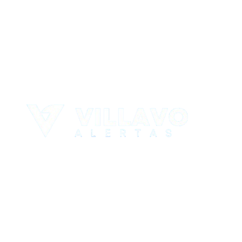

# VillavoAlertas



Este proyecto fue desarrollado durante una hackathon para abordar la problemática de seguridad en Villavicencio. La aplicación alerta tanto a la población como a las entidades gubernamentales sobre el estado de la seguridad en la ciudad, proporcionando información en tiempo real y generando alertas relevantes sobre riesgos.

## Tecnologías Utilizadas

- **Next.js**: Framework principal utilizado para el desarrollo de la aplicación web.
- **MongoDB**: Base de datos NoSQL para almacenar las alertas y usuarios.
- **NextAuth**: Sistema de autenticación para gestionar el acceso de usuarios.
- **OpenAI API**: Utilizada para generar textos y resúmenes automáticos de las alertas.
- **Cloudinary**: Alojamiento de imágenes para gestionar archivos multimedia.
- **Shadcn/ui**: Biblioteca de componentes UI para una interfaz moderna y accesible.
- **PWA (Progressive Web App)**: La aplicación está optimizada para funcionar tanto en dispositivos móviles como en escritorio, ofreciendo una experiencia fluida.

## Funcionalidades Clave

1. **Publicación de Alertas**: Los usuarios pueden ver las alertas relacionadas con la seguridad en la ciudad.
2. **Generación de Textos Automáticos**: A través de la integración con OpenAI, se generan avisos y recomendaciones de las alertas de manera automática.
3. **Autenticación**: Uso de NextAuth para que los administradores inicien sesión con seguridad.
4. **Notificaciones en Tiempo Real**: Las entidades y ciudadanos reciben notificaciones instantáneas cuando se publica una nueva alerta.
5. **Alojamiento de Imágenes**: Las imágenes asociadas a las alertas se almacenan en Cloudinary, asegurando un rendimiento óptimo y una fácil gestión.
6. **Compatibilidad PWA**: La aplicación puede instalarse en dispositivos móviles y funciona offline para asegurar el acceso a la información crucial en todo momento.

## Instalación y Configuración

1. Clonar el repositorio:

    ```bash
    git clone https://github.com/shogunIncognito/hacka-villavo-alerta.git
    ```

2. Instalar las dependencias:

    ```bash
    cd hacka-villavo-alerta
    npm install
    ```

3. Configurar variables de entorno:

    Crear un archivo `.env.local` con las siguientes variables:

    ```env
    NEXTAUTH_SECRET=<key>
    MONGO_URI=<key>
    JWT_SECRET=<key>
    OPENAI_API_KEY=<key>
    ```

4. Ejecutar la aplicación en modo desarrollo:

    ```bash
    npm run dev
    ```

5. La aplicación estará disponible en `http://localhost:3000`.

## Despliegue

El proyecto puede desplegarse fácilmente en plataformas como Vercel, que ofrece soporte nativo para aplicaciones Next.js. Sigue la [documentación de Vercel](https://vercel.com/docs) para realizar el despliegue.

## Colaboradores

- **Juankio**: [GitHub](https://github.com/juankio)
- **EmersonRoncancio**: [GitHub](https://github.com/EmersonRoncancio)
- **Yo**: [GitHub](https://github.com/shogunIncognito)
